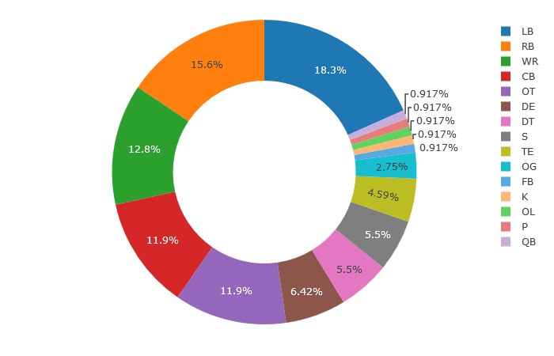

---
output:
  html_document: default
  pdf_document: default
---
# NFL Arrests Database

# Table of Contents

1. [Introduction](#introduction)

2. [Data Collection and Cleaning](#dataCC)

3. [Text Mining and Prediction: Naive Bayes Edition](#NB)

   i. [Training and Testing the NB Algorithm](#trainTestNB)
   
   ii. [Making Predictions](#predictNB)

4. [Are Defensive Tacklers More Prone to Commit Violent Crimes?](#thesis)

   i. [Preliminary Analysis](#prelimAnal)

<a name="introduction"></a> 
# Introduction

If the only thing you knew about a person is that they're a football player and a violent criminal, what position do you think they play? This was a question a friend of mine posed to me one day, one that I figured had already been researched and that the answer was only a quick Google search away. It isn't, but there is a database on [USA TODAY](https://www.usatoday.com/sports/nfl/arrests/) that records NFL player arrests with information such as their name, position, team they played for, type of crime, etc. To me, this was an even better find than the answer itself, because now I had the opportunity to explore the question first hand!

The hypothesis (a la my friend) was that players who committed violent crimes were more likely to hold positions that required more physical aggression, which we thought would be the majority of the defensive positions (e.g. Linebackers, Cornerbacks, etc.).

<a name="dataCC"></a> 
# Data Collection and Cleaning

The first thing to do is collect and clean the data, which can be accomplished by building a webscraper to go on the USA Today website and scrap the database. 

*A very sincere hat tip to [Andrew Cantino](https://vimeo.com/tectonic) for creating the [Selector Gadget](https://selectorgadget.com/) tool that helped me parse through html code and identify the css input needed to scrap the data columns.

```R
install.packages('rvest')
library('rvest')

WebScraper = function(url, css){
  webpage = read_html(url)
  htmlColumn = html_nodes(webpage, css)
  column = html_text(htmlColumn)
  return(column)
  }
  
website = 'https://www.usatoday.com/sports/nfl/arrests/'

NAMES = WebScraper(website, '.arrest-name')
POS = WebScraper(website, '.arrest-narrow:nth-child(4)')
TEAM = WebScraper(website, '.arrest-narrow:nth-child(2)')
CASE = WebScraper(website, '.arrest-midsize:nth-child(5)')
CATEGORY = WebScraper(website, '.arrest-midsize:nth-child(6)')
DESCRIPTION = WebScraper(website, '.left:nth-child(7)')
OUTCOME = WebScraper(website, '.outcome')

NFL_dataframe = data.frame("NAMES" = NAMES, "POS" = POS, "TEAM" = TEAM,
                           "CASE" = CASE, "CATEGORY" = CATEGORY, 
                           'DESCRIPTION' = DESCRIPTION, 
                           'OUTCOME' = OUTCOME, stringsAsFactors = FALSE)
```

Note that in the "OUTCOME" column of the dataframe there are many entries with the sentence "Resolution undetermined." These are players who have yet to be deemed guilty or not guilty. For my purpose, it's best to remove these players from the database since only players with known verdicts are of importance. The following piece of code will accomplish this, as well as define an empty column titled "GUILTY" (which will be elaborated on below).

```R

NFL_dataframe = NFL_dataframe[grepl("Resolution undetermined", 
                                    NFL_dataframe$OUTCOME) == FALSE, ]
NFL_dataframe$GUILTY = NA

```

<a name="NB"></a> 
# Text Mining and Prediction: Naive Bayes Edition

Now all the remaining players within the database need to be classified as either guilty or not guilty -- i.e. a value of 1 in the GUILTY column if guilty and 0 otherwise.

I *could* just go through each row and categorize each row a 1 or a 0 based on the description in the OUTCOME column, but that would take too long. It would be better to write an algorithm that mines the text in the OUTCOME column and then predicts whether or not to classify each player as guilty or not guilty based on what it reads. A homemade Naive Bayes R script will do this.

If you want to learn the theory behind Naive Bayes (NB) combined with Bag-of-Words (BoW) as a method of text classification, there are plenty of references out there, but the ones I thought were most useful were [here](https://www.youtube.com/watch?v=EGKeC2S44Rs) (for learning how to do it by hand), [here](https://web.stanford.edu/~jurafsky/slp3/slides/7_Sent.pdf) (as an overview of sentiment analysis), and [here](https://nlp.stanford.edu/IR-book/html/htmledition/the-bernoulli-model-1.html) (more into the weeds. About ~90% of how my code is structured is based on the information contained within this link).  

<a name="trainTestNB"></a> 
## Training and Testing the NB Algorithm

First, I will (unfortunately) have to manually label some of the rows with either a 0 or a 1 (which I did in Excel for the first 108) so that the algorithm can train on said rows and use the results to make predictions on the rest of the players in the dataset.

Now for the actual code; below is my homemade version of the Bernoulli NB algorithm. Since I want to keep the focus on the thesis at hand, I'm not going to do a "deep dive" into the NB code itself; that's another project in and of itself.

```R

library(dplyr)
library(tm)
library(tidytext)

NaiveBayes = function(dataFrame, textColumn, outcomeColumn, percentTrain){
  
  #Shuffles the dataframe
  set.seed(0)
  df = sample_n(dataFrame, nrow(dataFrame))
  
  #Splits data into training and test set
  lastTrainRow = round(percentTrain * nrow(df))
  train = df[1:lastTrainRow, ]
  test = df[-(1:lastTrainRow), ]
  
  #Get a corpus of the training data and clean it by removing lower-case
  #letters, punctuation, English "stopwords", and whitespace.
  
  trainCorpus = VCorpus(VectorSource(train[, textColumn]))
  trainCorpus = trainCorpus %>% 
    tm_map(content_transformer(tolower)) %>%
    tm_map(removePunctuation) %>%
    tm_map(removeWords, stopwords(kind = "en")) %>%
    tm_map(stripWhitespace)
  
  #Gets a document term matrix to use for the actual algorithm and 
  #filters infrequent words
  
  dtmTrain = DocumentTermMatrix(trainCorpus)
  
  freqTerms = findFreqTerms(dtmTrain, 5)
  
  dtmTrain = DocumentTermMatrix(trainCorpus, control =
                                   list(dictionary = freqTerms))
  
  #Starts the Bernoulli Naive Bayes Algorithm
  
  #1. Extract vocabulary from training data
  
  vocab = Terms(dtmTrain)
  
  #2. Count the total number of documents N
  
  totDocs = nDocs(dtmTrain)
  
  #3. Get the prior probabilities for class 1 and class 0 -- i.e. N_c/N
  
  nClass0 = nrow(train[train[ ,outcomeColumn] == 0, ])
  nClass1 = nrow(train[train[ ,outcomeColumn] == 1, ])
  priorProb0 = nClass0 / totDocs
  priorProb1 = nClass1 / totDocs
  
  #4. Count the number of documents in each class 'c' containing term 't'
  
  trainTibble = tidy(as.matrix(dtmTrain))
  trainTibble$categ = train[,outcomeColumn]
  nDocsPerTerm0 = colSums(trainTibble[trainTibble$categ == 0, ])
  nDocsPerTerm1 = colSums(trainTibble[trainTibble$categ == 1, ])

  
  #5. Get the conditional probabilities for the data
  
  termCondProb0 = (nDocsPerTerm0 + 1)/(nClass0 + 2)
  termCondProb1 = (nDocsPerTerm1 + 1)/(nClass1 + 2)
  
  #6. Clean the test data
  
  testCorpus = VCorpus(VectorSource(test[,textColumn]))
  testCorpus = testCorpus %>% 
    tm_map(content_transformer(tolower)) %>%
    tm_map(removePunctuation) %>%
    tm_map(removeWords, stopwords(kind = "en")) %>%
    tm_map(stripWhitespace)
  
  dtmTest = DocumentTermMatrix(testCorpus)
  freqTermsTest = findFreqTerms(dtmTest, 5)
  dtmTest = DocumentTermMatrix(testCorpus, control =
                                   list(dictionary = freqTermsTest))
  
  #7. Extract vocab from test data
 
 vocabTest = Terms(dtmTest)
  
  #8. Compute "guilty" vs. "not guilty" probability of each player, compare them, and classify player based on the result.
  
  classifiedRows = c()
  
  for (i in 1:nDocs(dtmTest)) {

    score0 = priorProb0
    score1 = priorProb1
  
    doc = colSums(as.matrix(dtmTest[i, ]))
    doc = doc[doc>0]
  
    for (j in 1:length(termCondProb0)){
      if (names(termCondProb0)[j] %in% names(doc) == TRUE)
        score0 = score0 * unname(termCondProb0[j])
      else
        score0 = score0 *(1 - unname(termCondProb0[j]))
    }
  
    for (k in 1:length(termCondProb1)){
      if (names(termCondProb1)[k] %in% names(doc) == TRUE)
        score1 = score1 * unname(termCondProb1[k])
      else
        score1 = score1 * (1 - unname(termCondProb1[k]))
    }
  
   if(score0 >= score1)
     classifiedRows = append(classifiedRows, 0)
   else
     classifiedRows = append(classifiedRows, 1)
  
  
   }

  
  return(list('classifiedRows' = classifiedRows, 'test' = test))

```
Cool! Now to test it out to see if it works. Recall that one of the parameters required for our function is what percentage of the dataframe (in decimal form) should act as the training data. For this exercise, I'm choosing 60%, which is a "rule-of-thumb" standard.

```R

> df = as.data.frame(NFL_Dataframe_Cleaned[1:108,])
> nb = NaiveBayes(df, "OUTCOME", "GUILTY", 0.6)
> mean(nb$predict == nb$actual)
[1] 0.8837209

```
88%!!! Not perfect, but I'd say that's pretty darn good!

<a name="predictNB"></a>
## Making Predictions

Now the code needs to be slightly modified so that it can make predictions on the full dataframe. That's easy, just do the following two things... 

1. Change the input parameters of the code to the ones below.

```R

NaiveBayes = function(trainData, testData, textColumn, outcomeColumn){

```

2. At the very beginning of the code (before you set the seed), define the first two parameters as 'train' and 'test'.

```R

train = trainData
test = testData

```
3. Remove the following bit of code from your function

```R
  
  #Shuffles the dataframe
  set.seed(0)
  df = sample_n(dataFrame, nrow(dataFrame))
  
  #Splits data into training and test set
  lastTrainRow = round(percentTrain * nrow(df))
  train = df[1:lastTrainRow, ]
  test = df[-(1:lastTrainRow), ]

```

4. Finally, change the output that your function returns to be

```R

return(classifiedRows) #This will return a vector classifying the other 567 unclassified rows -- i.e. the testData portion.

```

Great! Now execute the code like so...

```R

> df = as.data.frame(NFL_Dataframe_Cleaned)
> dfTrain = df[1:108,]
> dfTest = df[109:nrow(df),]
> nbResults = NaiveBayes(dfTrain, dfTest, "OUTCOME", "GUILTY")
> df[109:nrow(df), "GUILTY"] = nbResults 

```
Awesome! Now that the dataframe has all the players classified as guilty or not guilty.

<a name="thesis"></a> 
# Are Defensive Tacklers More Prone to Commit Violent Crimes?

<a name="prelimAnal"></a>
## Preliminary Modifications & Analysis

With the newly classified database in hand, it's time to do some analysis. Since our focus will be on violent crimes, we'll need to decide first what exactly we mean by that. Broadly speaking, a violent crime occurs when the offender uses or threatens the use of force upon their victim*.  However, one problem with the database is that the information contained in the "CATEGORY" column is either poorly defined and/or redundant. For example, some players like Dan Connor will have their crime categorized as something as ambiguous as "Weapon", which raises questions such as "Was this player arrested for possessing an illegal weapon, or using a weapon during a murder/assault, or both?" This requires a bit of a deep dive into all the 93 different categories and deciding which ones qualify as a violent crime. As for dealing with redundancy, such as categorizing a crime as "Domestic violence, alcohol" or "Domestic violence, gun", crimes will be categorized as either "Aggravated Assault", "Sexual Assault/Rape", "Robbery", or "Murder" based on whether the description of the crime fits the corresponding categories' definition as defined by the FBI's 2017 [Uniform Crime Reporting (UCR) Database.](https://ucr.fbi.gov/crime-in-the-u.s/2017/crime-in-the-u.s.-2017/topic-pages/violent-crime) The following bit of code will add another column that classifies a crime as one of the 4 violent crime categories stated earlier and everything else as "Non-violent".

<sub><sup>\* This does carry some nuances with it. For example, does brandishing a weapon constitute a threat to use force in the same manner that pulling it out and yelling "I'm going to use this on you!" does? Another nuance is that the definition of what qualifies as a certain sort of violent crime may change over time (e.g. "rape" has had multiple definitions according the FBI's Uniform Crime Reporting (UCR) Program within the past 6 years, which affects how the statistics are reported). To make the analysis as accurate as possible, the most recent definitions of violent crimes were used according to the definitions set by the UCR (see "Murder & Nonnegligent Manslaughter", "Legacy Rape", "Revised Rape", "Robbery", and "Aggravated Assault").</sup></sub>

```R
AA = c("Domestic violence", "Bomb threat", "Battery", "Assault, gun", "Attempted murder",
       "Battery, resisting arrrest", "Domestic", "Gun, assault", "Assault", "Child abuse", "Assault, alcohol",
       "DUI, assault", "Alcohol, assault", "Coercion, gun", "Battery, alcohol", 
       "Domestic violeance, alcohol", "Domestic violence, gun")

SAR = c("Sexual assault", "Domestic violence, rape")

robbery = c("Burglary, assault", "Robbery", "Theft, gun", "Burglary, battery")

murder = c("Manslaughter, child abuse", "Murder", "Murder, gun", "Manslaughter")

df$VIOLENT_NONVIOLENT = ifelse(df$CATEGORY %in% AA, "Aggravated Assault", 
                          ifelse(df$CATEGORY %in% SAR, "Sexual Assault/Rape",
                            ifelse(df$CATEGORY %in% robbery, "Robbery", 
                              ifelse(df$CATEGORY %in% murder, "Murder", "Non-violent"))))


```
Now for some basic data visualizations to see if we can spot any trends in the data. For this, well create some basic donut charts to see if there are any differences between the positions of players arrested for violent crimes and the positions of players found guilty of committing violent crimes.

Donut Chart 1                             |  Donut Chart 2
:----------------------------------------:|:-------------------:
 | 


This is a test.
