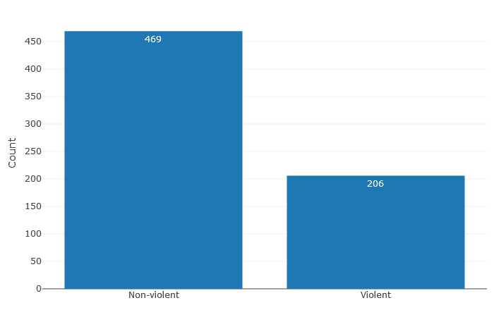
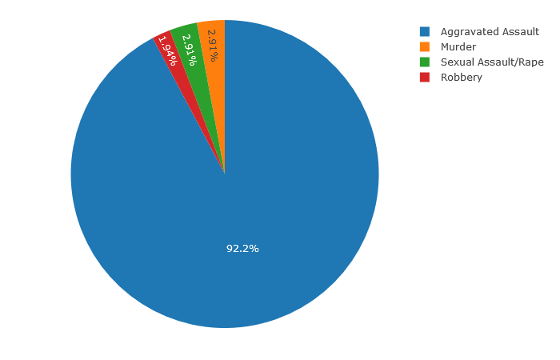
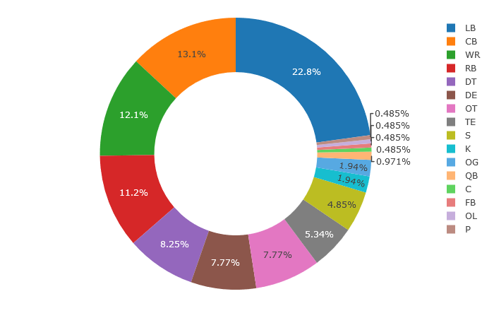
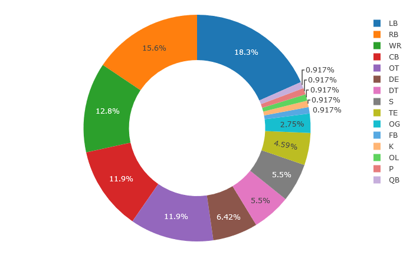

# NFL Arrests Database

# Table of Contents

1. [Introduction](#introduction)

2. [Required Packages](#packages)

3. [Data Collection and Cleaning](#dataCC)

4. [Text Mining and Prediction: Naive Bayes Edition](#NB)
    
    a) [Training and Testing the NB Algorithm](#trainTestNB)
<p>
5. [Thesis: Are Violent Criminal NFL Players More Likely to Play Defense?](#thesis)
    
    a) [Preliminary Analysis](#prelimAnal)
    
    b) [Alternative Hypothesis](#altHyp)
        
    c) [Multinomial Logistic Regression](#multinom)
        
    d) [Decision Trees](#tree)
   
<a name="introduction"></a> 

# Introduction

If the only thing you knew about a person is that they're a football player and a violent criminal, what position do you think they play? This was a question a friend of mine posed to me one day, one that I figured had already been researched and that the answer was only a quick Google search away. It isn't, but there is a database on [USA TODAY](https://www.usatoday.com/sports/nfl/arrests/) that records NFL player arrests with information such as their name, position, team they played for, type of crime, etc. To me, this was an even better find than the answer itself, because now I had the opportunity to explore the question first hand!

The hypothesis (a la my friend) was that players who committed violent crimes were more likely to hold positions that required more physical aggression, which we thought would be the majority of the defensive positions (e.g. Linebackers, Corner Backs, etc.) since they're job is to attack the offense.

<a name="packages"></a>

# Required Packages

For this project, we'll need to install and upload the following packages.

```R
library(readxl)
library(plotly)
library(nnet)
library(dplyr)
library(tm)
library(tidytext)
library(rvest)
```

<a name="dataCC"></a> 

# Data Collection and Cleaning

The first thing to do is collect and clean the data, which can be accomplished by building a web scraper to go on the USA Today website and scrap the database. 

*A very sincere hat tip to [Andrew Cantino](https://vimeo.com/tectonic) for creating the [Selector Gadget](https://selectorgadget.com/) tool that helped me parse through html code and identify the css input needed to scrap the data columns.

```R
WebScraper = function(url, css){
  webpage = read_html(url)
  htmlColumn = html_nodes(webpage, css)
  column = html_text(htmlColumn)
  return(column)
  }
  
website = 'https://www.usatoday.com/sports/nfl/arrests/'

NAMES = WebScraper(website, '.arrest-name')
POS = WebScraper(website, '.arrest-narrow:nth-child(4)')
TEAM = WebScraper(website, '.arrest-narrow:nth-child(2)')
CASE = WebScraper(website, '.arrest-midsize:nth-child(5)')
CATEGORY = WebScraper(website, '.arrest-midsize:nth-child(6)')
DESCRIPTION = WebScraper(website, '.left:nth-child(7)')
OUTCOME = WebScraper(website, '.outcome')

NFL_dataframe = data.frame("NAMES" = NAMES, "POS" = POS, "TEAM" = TEAM,
                           "CASE" = CASE, "CATEGORY" = CATEGORY, 
                           'DESCRIPTION' = DESCRIPTION, 
                           'OUTCOME' = OUTCOME, stringsAsFactors = FALSE)
```

Note that in the "OUTCOME" column of the data frame there are many entries with the sentence "Resolution undetermined." These are players who have yet to be deemed guilty or not guilty. For my purpose, it's best to remove these players from the database since only players with known verdicts are of importance. The following piece of code will accomplish this, as well as define an empty column titled "GUILTY" (which will be elaborated on below).

```R
NFL_dataframe = NFL_dataframe[grepl("Resolution undetermined", 
                                    NFL_dataframe$OUTCOME) == FALSE, ]
NFL_dataframe$GUILTY = NA
```

<a name="NB"></a> 

# Text Mining and Prediction: Naive Bayes Edition

Now all the remaining players within the database need to be classified as either guilty or not guilty -- i.e. a value of 1 in the GUILTY column if guilty and 0 otherwise.

I *could* just go through each row and categorize each row a 1 or a 0 based on the description in the OUTCOME column, but that would take too long. It would be better to write an algorithm that mines the text in the OUTCOME column and then predicts whether or not to classify each player as guilty or not guilty based on what it reads. A homemade Naive Bayes R script will do this.

If you want to learn the theory behind Naive Bayes (NB) combined with Bag-of-Words (BoW) as a method of text classification, there are plenty of references out there, but the ones I thought were most useful were [here](https://www.youtube.com/watch?v=EGKeC2S44Rs) (for learning how to do it by hand), [here](https://web.stanford.edu/~jurafsky/slp3/slides/7_Sent.pdf) (as an overview of sentiment analysis), and [here](https://nlp.stanford.edu/IR-book/html/htmledition/the-bernoulli-model-1.html) (more into the weeds. About ~90% of how my code is structured is based on the information contained within this link).  

<a name="trainTestNB"></a> 

## Training and Testing the NB Algorithm

First, I will (unfortunately) have to manually label some of the rows with either a 0 or a 1 (which I did in Excel for the first 108) so that the algorithm can train on said rows and use the results to make predictions on the rest of the players in the data set.

Two versions of the NB algorithm will be created; one to test the code on the first 108 rows mentioned to make sure it's running properly and making accurate predictions, and one slightly modified to classify the remaining unclassified rows.

Below is the "testing" version of the code. (It's currently folded up due to its sheer length.)

<details><summary>Bernoulli Naive Bayes - Testing</summary>

```R
NaiveBayes = function(dataFrame, textColumn, outcomeColumn, percentTrain){
  
  ## Shuffles the dataframe
  
  set.seed(123)
  df = sample_n(dataFrame, nrow(dataFrame))
  
  ## Splits data into training and test set
  lastTrainRow = round(percentTrain * nrow(df))
  train = df[1:lastTrainRow, ]
  test = df[-(1:lastTrainRow), ]
  
  ## Get a corpus of the training data and clean it by removing lower-case
  ## letters, punctuation, English "stopwords", and whitespace.
  
  trainCorpus = VCorpus(VectorSource(train[, textColumn]))
  trainCorpus = trainCorpus %>% 
    tm_map(content_transformer(tolower)) %>%
    tm_map(removePunctuation) %>%
    tm_map(removeWords, stopwords(kind = "en")) %>%
    tm_map(stripWhitespace)
  
  ## Gets a document term matrix to use for the actual algorithm and 
  ## filters infrequent words
  
  dtmTrain = DocumentTermMatrix(trainCorpus)
  
  freqTerms = findFreqTerms(dtmTrain, 5)
  
  dtmTrain = DocumentTermMatrix(trainCorpus, control =
                                   list(dictionary = freqTerms))
  
  ## Starts the Bernoulli Naive Bayes Algorithm
  
  #1. Extract vocabulary from training data
  vocab = Terms(dtmTrain)
  
  #2. Count the total number of documents N
  totDocs = nDocs(dtmTrain)
  
  #3. Get the prior probabilities for class 1 and class 0 -- i.e. N_c/N
  nClass0 = nrow(train[train[ ,outcomeColumn] == 0, ])
  nClass1 = nrow(train[train[ ,outcomeColumn] == 1, ])
  priorProb0 = nClass0 / totDocs
  priorProb1 = nClass1 / totDocs
  
  #4. Count the number of documents in each class 'c' containing term 't'
  trainTibble = tidy(as.matrix(dtmTrain))
  trainTibble$categ = train[,outcomeColumn]
  nDocsPerTerm0 = colSums(trainTibble[trainTibble$categ == 0, ])
  nDocsPerTerm1 = colSums(trainTibble[trainTibble$categ == 1, ])
  nDocsPerTerm0 = nDocsPerTerm0[-length(nDocsPerTerm0)]
  nDocsPerTerm1 = nDocsPerTerm1[-length(nDocsPerTerm1)]
  
  #5. Get the conditional probabilities for the data
  
  termCondProb0 = (nDocsPerTerm0 + 1)/(nClass0 + 2)
  termCondProb1 = (nDocsPerTerm1 + 1)/(nClass1 + 2)
  
  #6. Clean the test data
  
  testCorpus = VCorpus(VectorSource(test[,textColumn]))
  testCorpus = testCorpus %>% 
    tm_map(content_transformer(tolower)) %>%
    tm_map(removePunctuation) %>%
    tm_map(removeWords, stopwords(kind = "en")) %>%
    tm_map(stripWhitespace)
  
  dtmTest = DocumentTermMatrix(testCorpus)
  freqTermsTest = findFreqTerms(dtmTest, 5)
  dtmTest = DocumentTermMatrix(testCorpus, control =
                                   list(dictionary = freqTermsTest))
  
  #7. Extract vocab from test data
  vocabTest = Terms(dtmTest)
  
  #8. Compute "guilty" vs. "not guilty" probability of each player, compare them, and classify player 
  # based on the result.
  
  classifiedRows = c()
  
  for (i in 1:nDocs(dtmTest)) {

    score0 = priorProb0
    score1 = priorProb1
  
     doc = colSums(as.matrix(dtmTest[i, ]))
     doc = doc[doc>0]
  
     for (j in 1:length(termCondProb0))
       if (names(termCondProb0)[j] %in% names(doc) == TRUE)
         score0 = score0 * unname(termCondProb0[j])
       else
         score0 = score0 *(1 - unname(termCondProb0[j]))
  
     for (k in 1:length(termCondProb1))
       if (names(termCondProb1)[k] %in% names(doc) == TRUE)
         score1 = score1 * unname(termCondProb1[k])
       else
         score1 = score1 * (1 - unname(termCondProb1[k]))
  
   if(score0 >= score1)
     classifiedRows = append(classifiedRows, 0)
   else
     classifiedRows = append(classifiedRows, 1)
   
     }

  return(list('predict' = classifiedRows, 'actual' = test[, outcomeColumn]))
  
}
```
</details>

<p>

Now to test the algorithm.

Quick note: One of the parameters required for our function is what percentage of the data frame (in decimal form) should act as the training data. Sixty percent will be chosen for this exercise, which is a "rule-of-thumb" standard.

```R
NFL_Dataframe_Cleaned <- read_excel("NFL Dataframe - Cleaned.xlsx")
df = as.data.frame(NFL_Dataframe_Cleaned[1:108,])                                  
nb = NaiveBayes(df, "OUTCOME", "GUILTY", 0.6)
mean(nb$predict == nb$actual)
[1] 0.9069767
```
90.7%!!! Not perfect, but I'd say that's pretty darn good!

Below is the algorithm modified to make predictions on the rest of the unclassified rows. (It's ~95% the same.)

<details><summary>Bernoulli Naive Bayes - Prediction</summary>

```R
NaiveBayes = function(trainData, testData, textColumn, outcomeColumn){

  train = trainData
  test = testData
  
  #Get a corpus of the training data and clean it by removing lower-case
  #letters, punctuation, English "stopwords", and whitespace.
  
  trainCorpus = VCorpus(VectorSource(train[, textColumn]))
  trainCorpus = trainCorpus %>% 
    tm_map(content_transformer(tolower)) %>%
    tm_map(removePunctuation) %>%
    tm_map(removeWords, stopwords(kind = "en")) %>%
    tm_map(stripWhitespace)
  
  #Gets a document term matrix to use for the actual algorithm and 
  #filters infrequent words
  
  dtmTrain = DocumentTermMatrix(trainCorpus)
  
  freqTerms = findFreqTerms(dtmTrain, 5)
  
  dtmTrain = DocumentTermMatrix(trainCorpus, control =
                                   list(dictionary = freqTerms))
  
  #Starts the Bernoulli Naive Bayes Algorithm
  
  #1. Extract vocabulary from training data
  vocab = Terms(dtmTrain)
  
  #2. Count the total number of documents N
  totDocs = nDocs(dtmTrain)
  
  #3. Get the prior probabilities for class 1 and class 0 -- i.e. N_c/N
  nClass0 = nrow(train[train[ ,outcomeColumn] == 0, ])
  nClass1 = nrow(train[train[ ,outcomeColumn] == 1, ])
  priorProb0 = nClass0 / totDocs
  priorProb1 = nClass1 / totDocs
  
  #4. Count the number of documents in each class 'c' containing term 't'
  trainTibble = tidy(as.matrix(dtmTrain))
  trainTibble$categ = train[,outcomeColumn]
  nDocsPerTerm0 = colSums(trainTibble[trainTibble$categ == 0, ])
  nDocsPerTerm1 = colSums(trainTibble[trainTibble$categ == 1, ])
  nDocsPerTerm0 = nDocsPerTerm0[-length(nDocsPerTerm0)]
  nDocsPerTerm1 = nDocsPerTerm1[-length(nDocsPerTerm1)]
  
  #5. Get the conditional probabilities for the data
  
  termCondProb0 = (nDocsPerTerm0 + 1)/(nClass0 + 2)
  termCondProb1 = (nDocsPerTerm1 + 1)/(nClass1 + 2)
  
  #6. Clean the test data
  
  testCorpus = VCorpus(VectorSource(test[,textColumn]))
  testCorpus = testCorpus %>% 
    tm_map(content_transformer(tolower)) %>%
    tm_map(removePunctuation) %>%
    tm_map(removeWords, stopwords(kind = "en")) %>%
    tm_map(stripWhitespace)
  
  dtmTest = DocumentTermMatrix(testCorpus)
  freqTermsTest = findFreqTerms(dtmTest, 5)
  dtmTest = DocumentTermMatrix(testCorpus, control =
                                   list(dictionary = freqTermsTest))
  
  #7. Extract vocab from test data
  vocabTest = Terms(dtmTest)
  
  #8. Classify the test data by computing the conditional probability that each document belongs to either
  # class1 or class 0, comparing said probabilities, and appending the results to an empty vector.
  
  classifiedRows = c()
  
  for (i in 1:nDocs(dtmTest)) {

    score0 = priorProb0
    score1 = priorProb1
  
     doc = colSums(as.matrix(dtmTest[i, ]))
     doc = doc[doc>0]
  
     for (j in 1:length(termCondProb0))
       if (names(termCondProb0)[j] %in% names(doc) == TRUE)
         score0 = score0 * unname(termCondProb0[j])
       else
         score0 = score0 *(1 - unname(termCondProb0[j]))
     
  
     for (k in 1:length(termCondProb1))
       if (names(termCondProb1)[k] %in% names(doc) == TRUE)
         score1 = score1 * unname(termCondProb1[k])
       else
         score1 = score1 * (1 - unname(termCondProb1[k]))
  
   if(score0 >= score1)
     classifiedRows = append(classifiedRows, 0)
   else
     classifiedRows = append(classifiedRows, 1)
  
     }
     
  return(classifiedRows)
  
}
```
</details>

<p>

Now all that's needed is to use the function to write the results to the other 567 unclassified rows.

```R
df = as.data.frame(NFL_Dataframe_Cleaned)
predictions = NaiveBayes(df[1:108,], df[109:nrow(df),], "OUTCOME", "GUILTY")
df[109:nrow(df), "GUILTY"] = predictions
```


<a name="thesis"></a> 

# Thesis: Are Violent Criminal NFL Players More Likely to Play Defense?

<a name="prelimAnal"></a>

## Preliminary Analysis

With the newly classified database in hand, it's time to do some analysis. Since our focus will be on violent crimes, we'll need to decide first what exactly we mean by that. Broadly speaking, a violent crime occurs when the offender uses or threatens the use of force upon their victim*.  However, one problem with the database is that the information contained in the "CATEGORY" column is either poorly defined and/or redundant. For example, some players like Dan Connor will have their crime categorized as something as ambiguous as "Weapon", which raises questions such as "Was this player arrested for possessing an illegal weapon, or using a weapon during a murder/assault, or both?" This requires a bit of a deep dive into all the 93 different categories and deciding which ones qualify as a violent crime. As for dealing with redundancy, such as categorizing a crime as "Domestic violence, alcohol" or "Domestic violence, gun", crimes will be categorized as either "Aggravated Assault", "Sexual Assault/Rape", "Robbery", or "Murder" based on whether the description of the crime fits the corresponding categories' definition as defined by the FBI's 2017 [Uniform Crime Reporting (UCR) Database.](https://ucr.fbi.gov/crime-in-the-u.s/2017/crime-in-the-u.s.-2017/topic-pages/violent-crime) The following bit of code will add another column that classifies a crime as one of the 4 violent crime categories stated earlier and everything else as "Non-violent".

<sub><sup>\* This does carry some nuances with it. For example, does brandishing a weapon constitute a threat to use force in the same manner that pulling it out and yelling "I'm going to use this on you!" does? Another nuance is that the definition of what qualifies as a certain sort of violent crime may change over time (e.g. "rape" has had multiple definitions according the FBI's Uniform Crime Reporting (UCR) Program within the past 6 years, which affects how the statistics are reported). To make the analysis as accurate as possible, the most recent definitions of violent crimes were used according to the definitions set by the UCR (see "Murder & Non-negligent Manslaughter", "Legacy Rape", "Revised Rape", "Robbery", and "Aggravated Assault").</sup></sub>

```R
## Defines violent crimes

violentCrimes = c("Domestic violence", "Bomb threat", 
                  "Sexual assault", "Battery",
                  "Assault, gun", "Domestic violence, rape",
                  "Attempted murder", 
                  "Battery, resisting arrrest", "Domestic",
                  "Gun, assault", "Burglary, assault",
                  "Manslaughter, child abuse", "Murder",
                  "Assault", "Robbery", "Child abuse",
                  "Assault, alcohol", "Murder, gun",
                  "DUI, assault", "Manslaughter", 
                  "Alcohol, assault", "Coercion, gun",
                  "Battery, alcohol",
                  "Domestic violence, alcohol", 
                  "Domestic violence, gun", "Theft, gun",
                  "Burglary, battery")

aggAssault = c("Domestic violence", "Bomb threat", 
               "Battery", "Assault, gun", "Attempted murder",
               "Battery, resisting arrrest", "Domestic", 
               "Gun, assault", "Assault", 
               "Child abuse", "Assault, alcohol",
               "DUI, assault", "Alcohol, assault", 
               "Coercion, gun", "Battery, alcohol", 
               "Domestic violence, alcohol", "Domestic violence, gun")

sexAssault = c("Sexual assault", "Domestic violence, rape")

robbery = c("Burglary, assault", "Robbery", 
            "Theft, gun", "Burglary, battery")

murder = c("Manslaughter, child abuse", "Murder", 
           "Murder, gun", "Manslaughter")

df$VIOLENT = ifelse(df$CATEGORY %in% violentCrimes, "Violent", "Non-violent")

df$VIOLENT_NONVIOLENT = ifelse(df$CATEGORY %in% aggAssault, "Aggravated Assault", 
                          ifelse(df$CATEGORY %in% sexAssault, "Sexual Assault/Rape",
                            ifelse(df$CATEGORY %in% robbery, "Robbery", 
                              ifelse(df$CATEGORY %in% murder, "Murder", "Non-violent"))))
```
Now for some basic data visualizations to see if we can spot any trends in the data. (For brevity, I'm omitting the code to create the charts here, but you can find it within the "NFL Arrest Analysis"" R Script uploaded to the repository.)

Non-Violent vs. Violent Crimes - Count    |  Violent Crimes by Category - Percentage
:----------------------------------------:|:----------------------------------------:
        | 

Based on the bar chart on the left, it seems the majority of the arrests (~ 69%) involve non-violent crimes. Amongst arrests for violent crimes, the vast majority involve some form of Aggravated Assault. 

Now lets look for interesting patterns amongst the players arrested for violent crimes grouped by their field position. For this, some basic donut charts will be created -- one for players accused for a crime and one for players found guilty of said crime.

Violent Crimes By Player Position (Accused) - Percentage  |  Violent Crimes By Player Position (Guilty) - Percentage
:--------------------------------------------------------:|:--------------------------------------------------------:
                 | 


Some interesting things from the donut chart...

1. Linebackers, Corner Backs, and Defensive Tacklers are all defensive positions that are in the top 5 for violent crime arrests. However, amongst players found guilty, they all show a decrease in representation! For Linebackers the decrease is 4.5 percentage points, for Corner Backs it's 1.2, and Defensive Tacklers it's 2.75.

2. Wide Receivers and Running Backs are both defensive positions that are also in the top 5 for violent crime arrests, but, unlike the defensive positions listed above, they all show an increase in representation amongst players found guilty! For Wide Receivers the increase is a measly 0.7 percentage points. What's most interesting is the notable increase for Running Backs and Offensive Tacklers, which is 4.4 and 4.13 respectively. 

These results seem contrary to our initial thoughts of players in defensive roles being more likely to commit violent crimes, and at first glance seem to go against our hypothesis. Does it?

<a name="altHyp"></a>

## Alternative Hypothesis

Recall that our original hypothesis that NFL players who are violent criminals were more likely to play in positions involving more physical aggression, which was thought to be mainly defensive positions since they involve "attacking" the offense to prevent them from obtaining points via touchdowns and field goal kicks. However, perhaps only half of that hypothesis is correct, but instead the greater likelihood of NFL positions being held by violent criminals are offensive positions rather than defensive ones. 

The intuition for such is as follows: To win a football game a team needs to score more points over their opponents. In order to do this, their Quarterbacks need to throw successful passes, Wide Receivers need to successfully catch the ball and run past the defense, Kickers need to be able to kick the ball through the field goal without being blocked, etc. If a coach wants to maximize the amount of points scored, they'll need to maximize their odds of having their offense be able to score points. One way to do this is to place their most aggressive players not in a defensive position, but in an offensive position that protects their Quarterbacks, Running Backs, Kickers, etc. from being tackled/blocked. This relationship, if it exists, would most likely be pronounced amongst Offensive Tacklers and to a lesser extent amongst Running Backs, which is what we saw earlier within our donut charts. 

<a name="multinom"></a>

### Multinomial Logistic Regression

One way to test our alternative hypothesis is to run a multinomial logistic regression for the various positions in the POS column on the binary categorical variable VIOLENT with only guilty players. If the new hypothesis carries any weight, there ought to be statistically significant positive correlation between the independent variable VIOLENT and the dependent variable positions OT (Offensive Tackle) and RB (Running Back).

```R

## Sets dataframe to just guilty players

df = df[df$GUILTY == 1, ]

model = multinom(POS ~ VIOLENT, df)

summary(model)

Call:
multinom(formula = POS ~ VIOLENT, data = df)

Coefficients:
   (Intercept) VIOLENTViolent
DB  -2.5648891  -1.174351e+01
DE  -0.4854779  -1.336258e-01
DT  -0.2962371  -4.770222e-01
FB  -2.2772117  -2.878493e-01
K   -2.0540725  -5.109715e-01
LB   0.1431264   2.875957e-01
OG  -1.4662977  -1.276587e-04
OL -17.3222808   1.475732e+01
OT  -1.1786219   1.178561e+00
P   -2.9702234   4.050669e-01
QB  -1.8717578  -6.932820e-01
RB  -0.1977985   4.659997e-01
S   -0.4446583  -3.285954e-01
TE  -0.9554773  -1.008747e-04
WR   0.6131299  -5.390908e-01

Std. Errors:
   (Intercept) VIOLENTViolent
DB   0.5991360    354.8510889
DE   0.2594383      0.5358029
DT   0.2452028      0.5511002
FB   0.5250091      1.1630159
K    0.4750125      1.1413112
LB   0.2187784      0.4180701
OG   0.3697992      0.7396034
OL   0.5188625      0.5188621
OT   0.3301129      0.5126562
P    0.7249549      1.2659489
QB   0.4385265      1.1266125
RB   0.2385198      0.4389009
S    0.2562063      0.5560825
TE   0.3038222      0.6076414
WR   0.1988231      0.4334495

Residual Deviance: 2011.887 
AIC: 2071.887 

```

As you can see, the coefficients for VIOLENT on the positions OT and RB are positive, though greater in magnitude for OT. To determine whether VIOLENT is statistically significant for any of the coefficient estimates, a z-test will be required.

```R

z = summary(model)$coefficients/summary(model)$standard.errors
p = (1-pnorm(abs(z), 0, 1)) * 2

p

    (Intercept) VIOLENTViolent
DB 1.860722e-05     0.97359947
DE 6.130838e-02     0.80305634
DT 2.269969e-01     0.38671966
FB 1.441316e-05     0.80451940
K  1.530520e-05     0.65436564
LB 5.129781e-01     0.49150779
OG 7.335943e-05     0.99986228
OL 0.000000e+00     0.00000000
OT 3.564910e-04     0.02150892
P  4.183319e-05     0.74899034
QB 1.969779e-05     0.53831132
RB 4.069489e-01     0.28835264
S  8.264384e-02     0.55457992
TE 1.661679e-03     0.99986754
WR 2.043774e-03     0.21360177


```

It appears that between the two, as well as any of the other positions listed, OT is the only position in which VIOLENT is statistically significant for (OL can be ignored because it represents one datum point.) Thus, we can conclude that our hypothesis carries reasonable weight in regards to Offensive Tacklers. 

<a name="tree"></a>

### Decision Trees

To be continued at some future date.